# Dataflow

[Dataflow](./diagrams/DataflowChart.md)

# Class Diagram

```mermaid
classDiagram
    %% Favorite Location
    class FavoriteLocationScreen {
      +onSearchInputChanged(query:String)
      +onSuggestionClick(fullText:String)
    }
    class FavoriteLocationViewModel {
      +favoriteLocations : MutableStateFlow~List~FavoriteLocation~
      -aggregateRepository: AggregateRepository
      -sessionToken: AutocompleteSessionToken
      +predictions: StateFlow~List~AutocompletePrediction~~
      +fetchPredictions(query:String)
      +addLocation(loc:String)
    }
    class FavoriteLocationRepository {
      +addLocationByName(placeName:String)
      +deleteLocationByName(placeName:String)
      +getAllLocations(): List~String~
    }
    class GeocoderClass {
      +getCoordinatesFromLocation(placeName:String): Pair~Double,Double~
    }
    class FavoriteLocationDataSource {
      -favoriteLocationsFile: File
      +addLocation(placeName:String,latitude:Double,longitude:Double)
      +deleteLocation(placeName:String)
      +getAllLocations(): List~String~
    }

    class AutocompletePrediction
    class AutocompleteSessionToken

    FavoriteLocationScreen "1" o-- "1" FavoriteLocationViewModel : ViewModel
    FavoriteLocationViewModel "1" -- "1" FavoriteLocationRepository : Data Repository
    FavoriteLocationViewModel ..> AggregateRepository : Dependency
    FavoriteLocationRepository "1" -- "1" GeocoderClass : Dependency
    FavoriteLocationRepository "1" -- "1" FavoriteLocationDataSource : DataSource

    %% Preferences
    class Preference {
      +desc: String
      +isEnabled: Boolean
    }
    class PreferenceDataSource {
      -preferencesFile: File
      +userPreference: StateFlow~List~Preference~~
      +loadPreferences()
      +updatePreference(desc:String, enabled:Boolean)
    }
    class PreferenceRepository {
      -dataSource: PreferenceDataSource
      +userPreference: StateFlow~List~Preference~~
      +updatePreference(desc:String, enabled:Boolean)
      +getEnabledPreferences(): List~Preference~
    }
    class PreferencesViewModel {
      -repo: PreferenceRepository
      +userPreferences: StateFlow~List~Preference~~
      +onPreferenceToggled(pref:Preference, enabled:Boolean)
      +navigateBack()
    }
    class PreferencesScreen {
      +displayPreferences()
      +onToggle(pref:Preference, enabled:Boolean)
      +onBack()
    }

    PreferenceRepository "1" -- "1" PreferenceDataSource : dataSource
    PreferencesViewModel "1" -- "1" PreferenceRepository : repo
    PreferencesScreen "1" -- "1" PreferencesViewModel : viewModel

    %% Navigation
    class Navbar {
      -favoriteLocationVM: FavoriteLocationViewModel
      -homeScreenVM: HomeScreenViewModel
      -mapScreenVM: MapScreenViewModel
      -preferencesVM: PreferencesViewModel
      +navigateToPreferences()
      +navigateToMap(activity: ActivitySuggestion)
    }
    class WelcomeScreen {
      +onContinue()
    }
    WelcomeScreen "1" --o "1" Navbar : navigation
    PreferencesViewModel "1" --o "1" Navbar : dependency
    HomeScreenViewModel "1" --o "1" Navbar : dependency
    MapScreenViewModel "1" --o "1" Navbar : dependency

    %% Home / Weather / Activities
    class HomeScreen {
      +navigateToPreferences()
      +onDaySelected(day:Int)
      +onRefreshActivity(day:Int,index:Int)
      +onViewActivityInMap(activity:ActivitySuggestion)
    }
    class HomeScreenViewModel {
      -aggregateRepository: AggregateRepository
      -_navigateToMap: MutableSharedFlow~ActivitySuggestion~
      +navigateToMap: SharedFlow~ActivitySuggestion~
      +navigateToPreferences()
      +viewActivityInMap(activity:ActivitySuggestion)
      +getActivitiesForAFutureDay(day:Int)
      +replaceActivityInDay(day:Int,index:Int)
    }

    class HomeScreenUiState {
      
    }

    HomeScreen "1" o-- "1" HomeScreenViewModel : viewModel
    HomeScreenViewModel "1" --o "1" AggregateRepository : dependency
    HomeScreenUiState "1" o-- "1" HomeScreenViewModel : UI State

    class AggregateRepository {
      -locationForecastRepository: LocationForecastRepository
      -placesRepository: PlacesRepository
      -stravaRepository: StravaRepository
      -preferenceRepository: PreferencesRepository
      -aiRepository: AiRepository
      -_currentLocation: _MutableLiveData~Location~
      -_deviceLocation: _MutableLiveData~Location~
      +getSuggestedActivitiesForOneDay(location: Location, day:Int): SuggestedActivities
      +replaceActivitiesForDay(day:Int, newActivities: SuggestedActivities)
      +getSuggestedActivity(location: Location, day:Int, index:Int): ActivitySuggestion
      +getNearbyPlaces(loc: Location): NearbyPlacesSuggestions
      +getAutocompletePredictions(query:String,token:AutocompleteSessionToken): List~AutocompletePrediction~
    }
    class LocationForecastRepository {
      +getTimeSeriesForDay(loc: Location, day:Int): Pair~List~TimeSeries~, Units~
    }
    class PlacesRepository {
      +getNearbyPlaces(loc: Location): NearbyPlacesSuggestions
      +getAutocompletePredictions(query:String,token:AutocompleteSessionToken): List~AutocompletePrediction~
    }
    class StravaRepository {
      +getRouteSuggestions(loc: Location): RoutesSuggestions
    }
    class PreferencesRepository {
      +getEnabledPreferences(): String
    }
    class AiRepository {
      -client: AiClient
      +getSuggestionsForOneDay(forecastData, nearbyPlaces, routes, preferences, exclusion): SuggestedActivities
      +getSingleSuggestionForDay(forecastData, nearbyPlaces, routes, preferences, exclusion): ActivitySuggestion
    }
    class AiClient {
      -ApiKey: String
      -BasePrompt: String
      +getSuggestionsForOneDay(forecastData, nearbyPlaces, routes, preferences, exclusion): String
      +getSingleSuggestionForDay(forecastData, nearbyPlaces, routes, preferences, exclusion): SuggestedActivities
    }
    class PlacesClient {
      -ApiKey: String
    }

    AggregateRepository "1" -- "1" LocationForecastRepository : dependency
    AggregateRepository "1" -- "1" PlacesRepository : dependency
    AggregateRepository "1" -- "1" StravaRepository : dependency
    AggregateRepository "1" -- "1" PreferencesRepository : dependency
    AggregateRepository "1" -- "1" AiRepository : dependency
    AiRepository "1" -- "1" AiClient : dependency
    PlacesClient "1" -- "1" PlacesRepository : dependency

    %% Map
    class MapScreen {
      +onNavigate(activity:ActivitySuggestion)
    }
    class MapScreenViewModel {
      -_mapScreenUiState: MutableStateFlow~MapScreenUiState~
      +zoomInOnActivity(activity:ActivitySuggestion)
      +decodePolyline(encoded:String): List~GeoPoint~
      +clearSelectedActivityPoints()
    }
    class MapScreenUiState {
      +places: List~PlaceActivitySuggestion~
      +routes: List~StravaActivitySuggestion~
      +isLoading: Boolean
      +errorMessage: String
      +selectedActivityPoints: List~GeoPoint~
    }
    class OsmMapView {
      -update(places, routes, selectedActivityPoints)
      +onZoomHandled()
    }
    class ActivitySuggestion
    class PlaceActivitySuggestion
    class StravaActivitySuggestion

    MapScreenUiState "1" --o "1" MapScreenViewModel : UI State
    MapScreen "1" --o "1" MapScreenViewModel : viewModel
    OsmMapView "1" --o "1" MapScreen : drives view
```

[Class Diagram](./diagrams/ClassDiagram.md)

# Use cases

## Use Case Diagram

[Use_Case_Diagram](./diagrams/usecase/UsecaseDiagram.svg)

## Add Favorite Location

**Name:** Add Favorite Location      
**Actors:** User

**Preconditions:**
- App is open on the favorite locations screen.

**Postconditions:**
- A new location is saved to persistent storage (file)
- Updated favorites list with the new location is displayed

**Main flow:**
1. User taps the **Add** icon.
2. System displays a search field.
3. User enters search text.
4. System calls the Places API for autocomplete suggestions.
5. System displays the list of suggestions.
6. User selects one suggestion.
7. System calls Geocoder to obtain coordinates for the selected place.
8. System saves the place name and coordinates to persistent storage.
9. System updates and displays the favorites list.

**Alternative flow – Empty Search Text:**

3.1. User enters an empty string.
3.2. System clears any existing suggestions.

**Alternative flow – No Suggestions Found:** 

3.4. User enters search text.      
3.5. System calls the Places API and receives no matches.      
3.6. System displays “No results.”

**Alternative flow – Location Already Saved:** 

6.8. User selects a suggestion.      
6.9. System detects the place already exists in favorites.      
6.10. System notifies the user, “Location already exists.”

[Activity Diagram](./diagrams/add_favorite_location/activitydiagram.md)

[Sequence Diagram](./diagrams/add_favorite_location/sequencediagram.md)

[Class Diagram](./diagrams/add_favorite_location/classdiagram.md)

## Find Activities for a Future Day

**Name:** Find Activities for a Future Day      
**Actors:** User

**Preconditions:**
- User is on the home screen with the weekly overview visible.

**Postconditions:**
- A list of generated suggested activities for the selected future day is displayed within the weekly overview.

**Main flow:**

1. User taps a day in the weekly overview.
2. System checks if activities are already loaded for that day.
3. If not loaded, system gathers weather forecast, nearby places, route options, and user preferences.
4. System sends the collected data to the AI service.
5. AI service returns a set of suggested activities.
6. System caches and displays the new activity list for the chosen day.

**Alternative flow – Existing Activities Present:**

1.1. User taps a day that already has loaded activities.      
1.2. System immediately displays the existing activity list.

**Alternative flow – Data Load Failure:**

5.1. System fails to retrieve data or receive AI suggestions.      
5.2. System displays an error message on the home screen.

[Activity Diagram](diagrams/find_activities_for_a_future_day/activitydiagram.md)

[Sequence Diagram](diagrams/find_activities_for_a_future_day/sequencediagram.md)

[Class Diagram](diagrams/find_activities_for_a_future_day/classdiagram.md)

## Refresh Activity

**Name:** Refresh Activity      
**Actors:** User

**Preconditions:**
- User is viewing activity cards for a specific day on the home screen.
- Activity card is not currently loading

**Postconditions:**
- The selected activity card is replaced with a newly generated suggested activity.

**Main flow:**
1. User taps the refresh icon on an activity card.
2. System displays a loading placeholder on that card.
3. System gathers current location, weather forecast, nearby places, route options, and user preferences.
4. System invokes the AI service for a single new activity suggestion.
5. AI service returns a new ActivitySuggestion.
6. System replaces the original card with the new suggestion.

**Alternative flow – Suggestion Failure:**

3.1. System fails to gather data.      
3.2. System restores the previous activity card state.      
3.3. System displays an error indicator on the card.

[Activity Diagram](diagrams/refresh_activity/activitydiagram.md)

[Sequence Diagram](diagrams/refresh_activity/sequencediagram.md)

[Class Diagram](diagrams/refresh_activity/classdiagram.md)

## View Activity in Map

**Name:** View Activity in Map      
**Actors:** User

**Preconditions:**
- User is viewing an activity card on the home screen.
- Activity for given activity card is not loading and is cached

**Postconditions:**
- The map screen is displayed, centered and zoomed on the selected activity coordinates.

**Main flow:**
1. User taps **View in Map** on an activity card.
2. System navigates to the map screen with the selected activity.

**Alternative flow – Single Location:**

2.1. System identifies activity as a single location.  
2.2. System retrieves its coordinates  
2.3. System places a marker at coordinate  
2.4. System updates the map view and centers camera on coordinate

**Alternative flow - Route:**  

2.1. System identifies activity as a route.  
2.2. System retrieves string encoded polyline  
2.3. System decodes polyline to get coordinates  
2.4. System draws route through coordinates  
2.5. System centers and zooms in on route coordinates

**Alternative flow – Decoding error:**

2.3.1. System fails to decode the polyline.      
2.3.2. System displays an error dialog instead of centering the map.

[Activity Diagram](./diagrams/view_activity_in_map/activitydiagram.md)

[Sequence Diagram](./diagrams/view_activity_in_map/sequencediagram.md)

[Class Diagram](./diagrams/view_activity_in_map/classdiagram.md)

## Edit User Preferences

**Name:** Edit User Preferences      
**Actors:** User

**Preconditions:**
- User is either a first-time user or a returning user.

**Postconditions:**
- User preferences are updated in persistent storage.
- Preferences Screen displays the updated list of preferences.

**Main flow:**
1. System checks if the user is a first-time user or a returning user.
2. For a returning user, the system displays the Home Screen.
3. Returning user taps the Gear icon on the Home Screen.
4. System loads preferences.
5. System navigates to the Preferences Screen.
6. User toggles a preference on the Preferences Screen.
7. System updates the UI state to reflect the change.
8. System saves selected preferences. 
9. If the user wishes to toggle more preferences, repeat from step 6; otherwise, the process ends.

**Alternative flow – First-Time User:**

1.1. System identifies the user as a first-time user.
1.2. System displays the Welcome Screen.
1.3. User taps "Kom i gang" on the Welcome Screen. 
1.4. Continue from step 4 in the main flow. 

[Activity Diagram](./diagrams/edit_preferences/activitydiagram.md)

[Sequence Diagram](./diagrams/edit_preferences/sequencediagram.md)

[Class Diagram](./diagrams/edit_preferences/classdiagram.md)

# Choice of diagrams

The selected use cases and diagrams describes the applications core functionality, as well as addressing many of the requirements 
listed in the project requirements. We have also made sure that the use cases are covering different components, so they provide 
a good overview of the application.

## Activity diagrams

The activity diagrams shows how the user interacts with the system and what happens in response. With these diagrams we aim
to give a better perspective on how conditional branches and loops work in the application depending on the users actions
and the state of the application.

## Sequence diagrams

The sequence diagrams illustrates how the different components of the program interact and communicate over time to
reach the postconditions of each use case. These diagrams are used to give a better overview of the responsibilities of
the viewModels, repositories and data sources and how they communicate in response to user actions.

## Class diagrams

Class diagrams provide a structural overview of the use cases, including classes that are involved and their relationships. 
They are used to highlight the use of design patterns and ensure that dependencies between classes are correctly aligned with 
architecture principles. 

