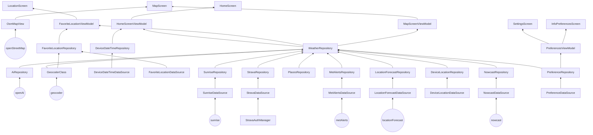

■ Beskrivelse og diagrammer, vi anbefaler å generere dem med
Mermaid som vist på forelesning. Se kravene til modellering
lenger ned i dette dokumentet. Ha med hvorfor diagrammet er
valgt og hva dere ønsker å med det.

Modellering og systemdesign
● De viktigste funksjonelle kravene til applikasjonen bør beskrives – bruk gjerne
use case diagram, samt sekvensdiagram og tekstlig beskrivelse av de
viktigste use-casene.
● Modelleringen bør også inneholde klassediagram som reflekterer use-case og
sekvensdiagrammene.
● Andre diagrammer bør også være inkludert for å få frem andre perspektiver,
for eksempel aktivitetsdiagram (flytdiagram) eller tilstandsdiagram.

