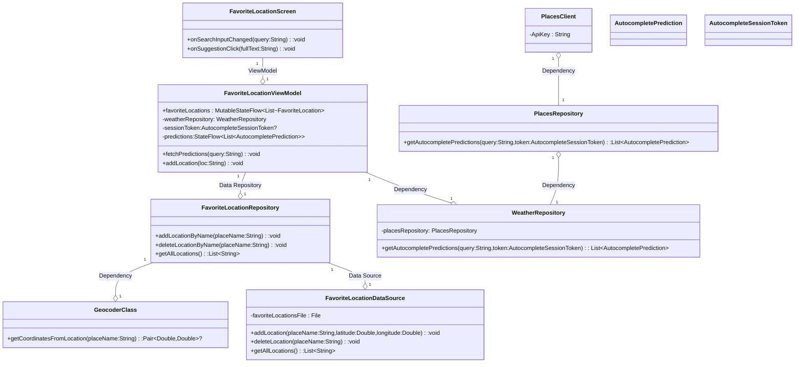

```mermaid
classDiagram
    FavoriteLocationScreen "1" --o "1" FavoriteLocationViewModel : ViewModel
    FavoriteLocationViewModel "1" --o "1" FavoriteLocationRepository : Data Repository
    FavoriteLocationViewModel "1" --o "1" WeatherRepository : Dependency
    FavoriteLocationRepository "1" --o "1" GeocoderClass : Dependency
    FavoriteLocationRepository "1" --o "1" FavoriteLocationDataSource : Data Source
    PlacesClient "1" o-- "1" PlacesRepository : Dependency
    PlacesRepository "1" o-- "1" WeatherRepository : Dependency

    class WeatherRepository {
      -placesRepository: PlacesRepository
            +getAutocompletePredictions(query:String,token:AutocompleteSessionToken): List~AutocompletePrediction~
    }

    class PlacesClient {
        -ApiKey : String
    }

    class FavoriteLocationScreen {
      +onSearchInputChanged(query:String):void
      +onSuggestionClick(fullText:String):void
    }

    class FavoriteLocationViewModel {
      +favoriteLocations : MutableStateFlow~List~FavoriteLocation~
      -weatherRepository: WeatherRepository
      -sessionToken:AutocompleteSessionToken?
      -predictions:StateFlow&lt;List&lt;AutocompletePrediction&gt;&gt;
      +fetchPredictions(query:String):void
      +addLocation(loc:String):void
    }

    class FavoriteLocationRepository {
      +addLocationByName(placeName:String):void
      +deleteLocationByName(placeName:String):void
      +getAllLocations():List&lt;String&gt;
    }

    class GeocoderClass {
      +getCoordinatesFromLocation(placeName:String):Pair&lt;Double,Double&gt;?
    }

    class FavoriteLocationDataSource {
      -favoriteLocationsFile : File
      +addLocation(placeName:String,latitude:Double,longitude:Double):void
      +deleteLocation(placeName:String):void
      +getAllLocations():List&lt;String&gt;
    }

    class PlacesRepository {
      +getAutocompletePredictions(query:String,token:AutocompleteSessionToken):List&lt;AutocompletePrediction&gt;
    }

    class AutocompletePrediction
    class AutocompleteSessionToken
```

