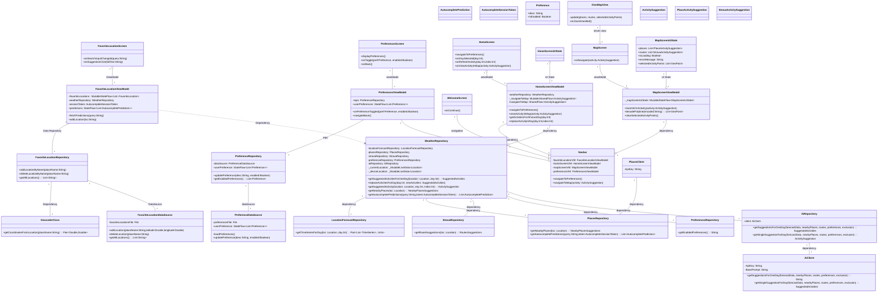

```mermaid
classDiagram
    %% Favorite Location
    class FavoriteLocationScreen {
      +onSearchInputChanged(query:String)
      +onSuggestionClick(fullText:String)
    }
    class FavoriteLocationViewModel {
      +favoriteLocations : MutableStateFlow~List~FavoriteLocation~
      -weatherRepository: WeatherRepository
      -sessionToken: AutocompleteSessionToken
      +predictions: StateFlow~List~AutocompletePrediction~~
      +fetchPredictions(query:String)
      +addLocation(loc:String)
    }
    class FavoriteLocationRepository {
      +addLocationByName(placeName:String)
      +deleteLocationByName(placeName:String)
      +getAllLocations(): List~String~
    }
    class GeocoderClass {
      +getCoordinatesFromLocation(placeName:String): Pair~Double,Double~
    }
    class FavoriteLocationDataSource {
      -favoriteLocationsFile: File
      +addLocation(placeName:String,latitude:Double,longitude:Double)
      +deleteLocation(placeName:String)
      +getAllLocations(): List~String~
    }

    class AutocompletePrediction
    class AutocompleteSessionToken

    FavoriteLocationScreen "1" o-- "1" FavoriteLocationViewModel : ViewModel
    FavoriteLocationViewModel "1" -- "1" FavoriteLocationRepository : Data Repository
    FavoriteLocationViewModel ..> WeatherRepository : Dependency
    FavoriteLocationRepository "1" -- "1" GeocoderClass : Dependency
    FavoriteLocationRepository "1" -- "1" FavoriteLocationDataSource : DataSource

    %% Preferences
    class Preference {
      +desc: String
      +isEnabled: Boolean
    }
    class PreferenceDataSource {
      -preferencesFile: File
      +userPreference: StateFlow~List~Preference~~
      +loadPreferences()
      +updatePreference(desc:String, enabled:Boolean)
    }
    class PreferenceRepository {
      -dataSource: PreferenceDataSource
      +userPreference: StateFlow~List~Preference~~
      +updatePreference(desc:String, enabled:Boolean)
      +getEnabledPreferences(): List~Preference~
    }
    class PreferencesViewModel {
      -repo: PreferenceRepository
      +userPreferences: StateFlow~List~Preference~~
      +onPreferenceToggled(pref:Preference, enabled:Boolean)
      +navigateBack()
    }
    class PreferencesScreen {
      +displayPreferences()
      +onToggle(pref:Preference, enabled:Boolean)
      +onBack()
    }

    PreferenceRepository "1" -- "1" PreferenceDataSource : dataSource
    PreferencesViewModel "1" -- "1" PreferenceRepository : repo
    PreferencesScreen "1" -- "1" PreferencesViewModel : viewModel

    %% Navigation
    class Navbar {
      -favoriteLocationVM: FavoriteLocationViewModel
      -homeScreenVM: HomeScreenViewModel
      -mapScreenVM: MapScreenViewModel
      -preferencesVM: PreferencesViewModel
      +navigateToPreferences()
      +navigateToMap(activity: ActivitySuggestion)
    }
    class WelcomeScreen {
      +onContinue()
    }
    WelcomeScreen "1" --o "1" Navbar : navigation
    PreferencesViewModel "1" --o "1" Navbar : dependency
    HomeScreenViewModel "1" --o "1" Navbar : dependency
    MapScreenViewModel "1" --o "1" Navbar : dependency

    %% Home / Weather / Activities
    class HomeScreen {
      +navigateToPreferences()
      +onDaySelected(day:Int)
      +onRefreshActivity(day:Int,index:Int)
      +onViewActivityInMap(activity:ActivitySuggestion)
    }
    class HomeScreenViewModel {
      -weatherRepository: WeatherRepository
      -_navigateToMap: MutableSharedFlow~ActivitySuggestion~
      +navigateToMap: SharedFlow~ActivitySuggestion~
      +navigateToPreferences()
      +viewActivityInMap(activity:ActivitySuggestion)
      +getActivitiesForAFutureDay(day:Int)
      +replaceActivityInDay(day:Int,index:Int)
    }

    class HomeScreenUiState {
      
    }

    HomeScreen "1" o-- "1" HomeScreenViewModel : viewModel
    HomeScreenViewModel "1" --o "1" WeatherRepository : dependency
    HomeScreenUiState "1" o-- "1" HomeScreenViewModel : UI State

    class WeatherRepository {
      -locationForecastRepository: LocationForecastRepository
      -placesRepository: PlacesRepository
      -stravaRepository: StravaRepository
      -preferenceRepository: PreferencesRepository
      -aiRepository: AiRepository
      -_currentLocation: _MutableLiveData~Location~
      -_deviceLocation: _MutableLiveData~Location~
      +getSuggestedActivitiesForOneDay(location: Location, day:Int): SuggestedActivities
      +replaceActivitiesForDay(day:Int, newActivities: SuggestedActivities)
      +getSuggestedActivity(location: Location, day:Int, index:Int): ActivitySuggestion
      +getNearbyPlaces(loc: Location): NearbyPlacesSuggestions
      +getAutocompletePredictions(query:String,token:AutocompleteSessionToken): List~AutocompletePrediction~
    }
    class LocationForecastRepository {
      +getTimeSeriesForDay(loc: Location, day:Int): Pair~List~TimeSeries~, Units~
    }
    class PlacesRepository {
      +getNearbyPlaces(loc: Location): NearbyPlacesSuggestions
      +getAutocompletePredictions(query:String,token:AutocompleteSessionToken): List~AutocompletePrediction~
    }
    class StravaRepository {
      +getRouteSuggestions(loc: Location): RoutesSuggestions
    }
    class PreferencesRepository {
      +getEnabledPreferences(): String
    }
    class AiRepository {
      -client: AiClient
      +getSuggestionsForOneDay(forecastData, nearbyPlaces, routes, preferences, exclusion): SuggestedActivities
      +getSingleSuggestionForDay(forecastData, nearbyPlaces, routes, preferences, exclusion): ActivitySuggestion
    }
    class AiClient {
      -ApiKey: String
      -BasePrompt: String
      +getSuggestionsForOneDay(forecastData, nearbyPlaces, routes, preferences, exclusion): String
      +getSingleSuggestionForDay(forecastData, nearbyPlaces, routes, preferences, exclusion): SuggestedActivities
    }
    class PlacesClient {
      -ApiKey: String
    }

    WeatherRepository "1" -- "1" LocationForecastRepository : dependency
    WeatherRepository "1" -- "1" PlacesRepository : dependency
    WeatherRepository "1" -- "1" StravaRepository : dependency
    WeatherRepository "1" -- "1" PreferencesRepository : dependency
    WeatherRepository "1" -- "1" AiRepository : dependency
    AiRepository "1" -- "1" AiClient : dependency
    PlacesClient "1" -- "1" PlacesRepository : dependency

    %% Map
    class MapScreen {
      +onNavigate(activity:ActivitySuggestion)
    }
    class MapScreenViewModel {
      -_mapScreenUiState: MutableStateFlow~MapScreenUiState~
      +zoomInOnActivity(activity:ActivitySuggestion)
      +decodePolyline(encoded:String): List~GeoPoint~
      +clearSelectedActivityPoints()
    }
    class MapScreenUiState {
      +places: List~PlaceActivitySuggestion~
      +routes: List~StravaActivitySuggestion~
      +isLoading: Boolean
      +errorMessage: String
      +selectedActivityPoints: List~GeoPoint~
    }
    class OsmMapView {
      -update(places, routes, selectedActivityPoints)
      +onZoomHandled()
    }
    class ActivitySuggestion
    class PlaceActivitySuggestion
    class StravaActivitySuggestion

    MapScreenUiState "1" --o "1" MapScreenViewModel : UI State
    MapScreen "1" --o "1" MapScreenViewModel : viewModel
    OsmMapView "1" --o "1" MapScreen : drives view
```

