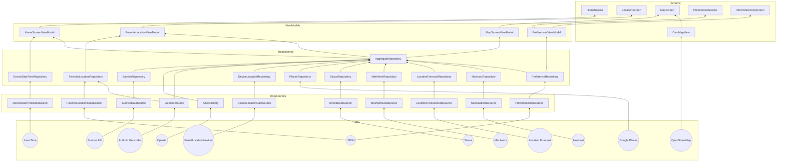

# Dataflowchart

```mermaid
flowchart BT
    %% === API-er ===
    subgraph APIs
        sapi((Sunrise API))
        aiapi((OpenAI))
        gapi((Android Geocoder))
        mapi((Met Alerts))
        lapi((Location Forecast))
        napi((Nowcast))
        oapi((OpenStreetMap))
        goapi((Google Places))
        fapi((FusedLocationProvider))
        stapi((Strava))
        json((JSON))
        jt((Java Time))
    end

    %% === Datasources ===
    subgraph DataSources
        sds[SunriseDataSource]
        air[AiRepository]
        gc[GeocoderClass]
        mds[MetAlertsDataSource]
        lfds[LocationForecastDataSource]
        nds[NowcastDataSource]
        dlds[DeviceLocationDataSource]
        stds[StravaDataSource]
        flds[FavoriteLocationDataSource]
        ddtds[DeviceDateTimeDataSource]
        pds[PreferenceDataSource]
    end

    %% === Repositories ===
    subgraph Repositories
        sr[SunriseRepository]
        ar[AggregateRepository]
        dlr[DeviceLocationRepository]
        flr[FavoriteLocationRepository]
        plr[PlacesRepository]
        str[StravaRepository]
        mr[MetAlertsRepository]
        lfr[LocationForecastRepository]
        nr[NowcastRepository]
        pr[PreferenceRepository]
        ddtr[DeviceDateTimeRepository]
    end

    %% === ViewModels og Skjermer ===
    subgraph ViewModels
        hsvm[HomeScreenViewModel]
        flvm[FavoriteLocationViewModel]
        msvm[MapScreenViewModel]
        pvm[PreferencesViewModel]
    end

    subgraph Screens
        hs[HomeScreen]
        ls[LocationScreen]
        ms[MapScreen]
        ss[PreferencesScreen]
        ips[InfoPreferencesScreen]
        omv[OsmMapView]
    end

    %% === Connections ===
    sapi --> sds --> sr --> ar
    aiapi --> air --> ar
    gapi --> gc --> ar
    fapi --> dlds --> dlr --> ar
    json --> flds --> flr --> flvm --> ls
    gc --> flr
    goapi --> plr --> ar
    stapi --> stds --> str --> ar
    mapi --> mds --> mr --> ar
    lapi --> lfds --> lfr --> ar
    napi --> nds --> nr --> ar
    json --> pds --> pr --> ar
    pr --> pvm --> ss
    pvm --> ips
    jt --> ddtds --> ddtr --> hsvm
    ar --> hsvm --> hs
    ar --> flvm
    ar --> msvm --> ms
    oapi --> omv --> ms
```