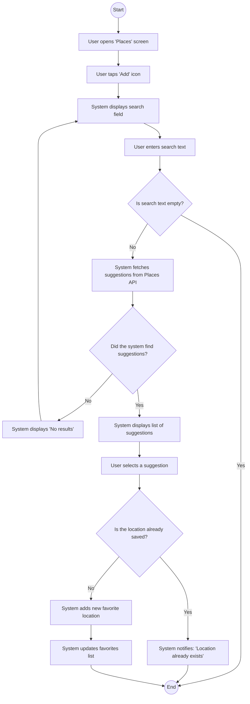

```mermaid
flowchart TD;
  Start((Start))
  Navigate[User opens 'Places' screen]
  PressAdd[User taps 'Add' icon]
  ShowSearchField[System displays search field]
  EnterSearch[User enters search text]
  DecText{Is search text empty?}
  FetchSuggestions[System fetches suggestions from Places API]
  DecSuggestions{Did the system find suggestions?}
  ShowNoResults[System displays 'No results']
  ShowSuggestions[System displays list of suggestions]
  SelectSuggestion[User selects a suggestion]
  DecExists{Is the location already saved?}
  ShowExists[System notifies: 'Location already exists']
  AddLocation[System adds new favorite location]
  UpdateList[System updates favorites list]
  End((End))

  Start --> Navigate --> PressAdd --> ShowSearchField --> EnterSearch --> DecText
  DecText -- Yes --> End
  DecText -- No --> FetchSuggestions --> DecSuggestions

  DecSuggestions -- No --> ShowNoResults --> ShowSearchField
  DecSuggestions -- Yes --> ShowSuggestions --> SelectSuggestion --> DecExists

  DecExists -- Yes --> ShowExists --> End
  DecExists -- No --> AddLocation --> UpdateList --> End

```