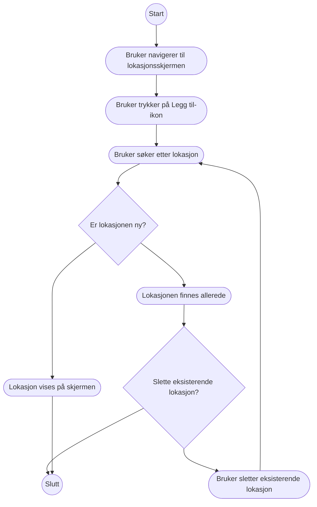

```mermaid

  flowchart TD;

    Start((Start))
    NavigerTilLokasjonsskjerm([Bruker navigerer til lokasjonsskjermen])
    TrykkLeggTilIkon([Bruker trykker på Legg til-ikon])
    SoekLokasjon([Bruker søker etter lokasjon])
    VisLokasjon([Lokasjon vises på skjermen])
    LokasjonEksistererAllerede([Lokasjonen finnes allerede])
    SlettEksisterendeLokasjon([Bruker sletter eksisterende lokasjon])

    Valg{Er lokasjonen ny?}
    Valg2{Slette eksisterende lokasjon?}

    Start --> NavigerTilLokasjonsskjerm 
    NavigerTilLokasjonsskjerm --> TrykkLeggTilIkon
    TrykkLeggTilIkon --> SoekLokasjon
    SoekLokasjon --> Valg
    Valg --> VisLokasjon
    Valg --> LokasjonEksistererAllerede
    LokasjonEksistererAllerede --> Valg2
    Valg2 --> SlettEksisterendeLokasjon
    SlettEksisterendeLokasjon --> SoekLokasjon
    Valg2 --> Slutt
    VisLokasjon --> Slutt

    Slutt((Slutt))


```