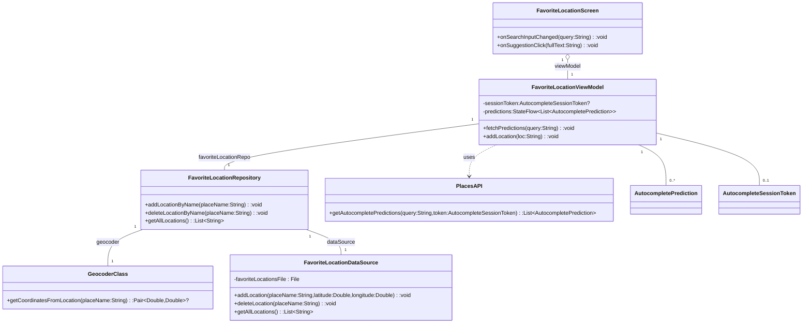

```mermaid
classDiagram
    FavoriteLocationScreen "1" o-- "1" FavoriteLocationViewModel : viewModel
    FavoriteLocationViewModel "1" -- "1" FavoriteLocationRepository : favoriteLocationRepo
    FavoriteLocationViewModel ..> PlacesAPI : uses
    FavoriteLocationRepository "1" -- "1" GeocoderClass : geocoder
    FavoriteLocationRepository "1" -- "1" FavoriteLocationDataSource : dataSource
    FavoriteLocationViewModel "1" -- "0..*" AutocompletePrediction
    FavoriteLocationViewModel "1" -- "0..1" AutocompleteSessionToken

    class FavoriteLocationScreen {
      +onSearchInputChanged(query:String):void
      +onSuggestionClick(fullText:String):void
    }

    class FavoriteLocationViewModel {
      -sessionToken:AutocompleteSessionToken?
      -predictions:StateFlow&lt;List&lt;AutocompletePrediction&gt;&gt;
      +fetchPredictions(query:String):void
      +addLocation(loc:String):void
    }

    class FavoriteLocationRepository {
      +addLocationByName(placeName:String):void
      +deleteLocationByName(placeName:String):void
      +getAllLocations():List&lt;String&gt;
    }

    class GeocoderClass {
      +getCoordinatesFromLocation(placeName:String):Pair&lt;Double,Double&gt;?
    }

    class FavoriteLocationDataSource {
      -favoriteLocationsFile : File
      +addLocation(placeName:String,latitude:Double,longitude:Double):void
      +deleteLocation(placeName:String):void
      +getAllLocations():List&lt;String&gt;
    }

    class PlacesAPI {
      +getAutocompletePredictions(query:String,token:AutocompleteSessionToken):List&lt;AutocompletePrediction&gt;
    }

    class AutocompletePrediction
    class AutocompleteSessionToken
```