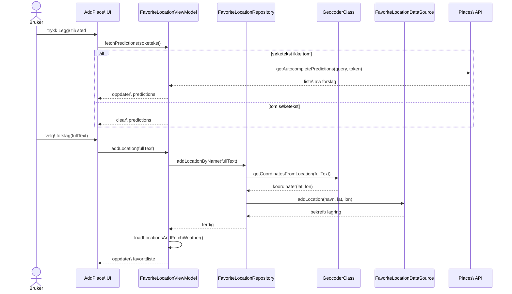

```mermaid
sequenceDiagram
    actor Bruker
    participant UI as AddPlace\ UI
    participant ViewModel as FavoriteLocationViewModel
    participant Repo as FavoriteLocationRepository
    participant Geocoder as GeocoderClass
    participant DataSource as FavoriteLocationDataSource
    participant PlacesAPI as Places\ API

    Bruker->>UI: trykk Legg\ til\ sted
    UI->>ViewModel: fetchPredictions(søketekst)
    alt søketekst ikke tom
        ViewModel->>PlacesAPI: getAutocompletePredictions(query, token)
        PlacesAPI-->>ViewModel: liste\ av\ forslag
        ViewModel-->>UI: oppdater\ predictions
    else tom søketekst
        ViewModel-->>UI: clear\ predictions
    end

    Bruker->>UI: velg\ forslag(fullText)
    UI->>ViewModel: addLocation(fullText)

    ViewModel->>Repo: addLocationByName(fullText)
    Repo->>Geocoder: getCoordinatesFromLocation(fullText)
    Geocoder-->>Repo: koordinater(lat, lon)
    Repo->>DataSource: addLocation(navn, lat, lon)
    DataSource-->>Repo: bekreft\ lagring
    Repo-->>ViewModel: ferdig

    ViewModel->>ViewModel: loadLocationsAndFetchWeather()
    ViewModel-->>UI: oppdater\ favorittliste
```