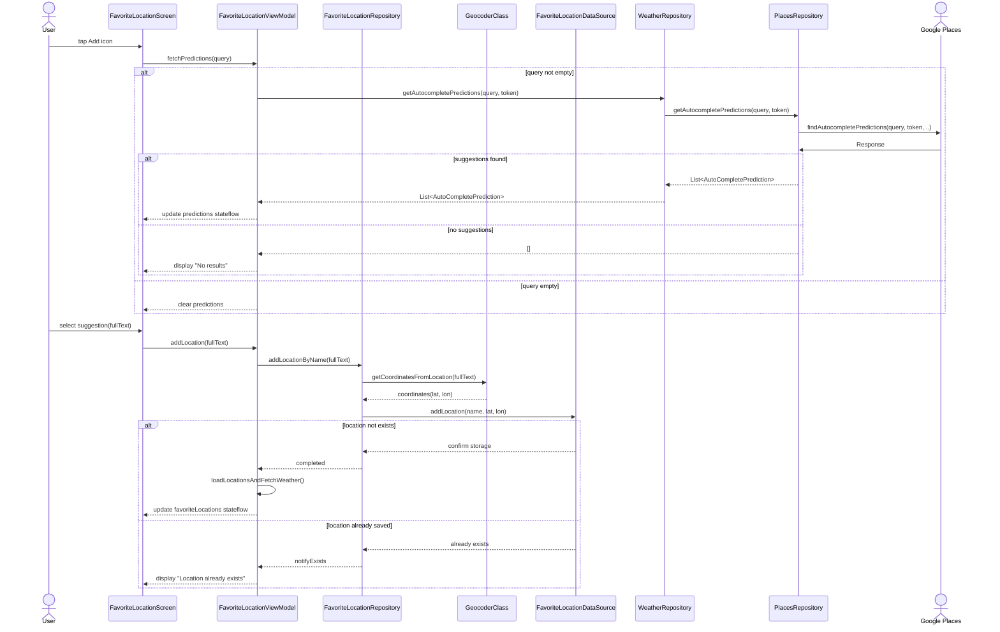

```mermaid
sequenceDiagram
  actor User as User
  participant UI as FavoriteLocationScreen
  participant VM as FavoriteLocationViewModel
  participant Repo as FavoriteLocationRepository
  participant Geocoder as GeocoderClass
  participant DS as FavoriteLocationDataSource
  Participant WR as WeatherRepository
  participant API as PlacesRepository
  actor Google as Google Places

  User ->> UI: tap Add icon
  UI ->> VM: fetchPredictions(query)
  alt query not empty
    VM ->> WR: getAutocompletePredictions(query, token)
    WR ->> API: getAutocompletePredictions(query, token)
    API ->> Google: findAutocompletePredictions(query, token, ..)
    Google ->> API: Response
    alt suggestions found
      API -->> WR: List<AutoCompletePrediction>
      WR -->> VM: List<AutoCompletePrediction>
      VM -->> UI: update predictions stateflow
    else no suggestions
      API -->> VM: []
      VM -->> UI: display "No results"
    end
  else query empty
    VM -->> UI: clear predictions
  end
  User ->> UI: select suggestion(fullText)
  UI ->> VM: addLocation(fullText)
  VM ->> Repo: addLocationByName(fullText)
  Repo ->> Geocoder: getCoordinatesFromLocation(fullText)
  Geocoder -->> Repo: coordinates(lat, lon)
  Repo ->> DS: addLocation(name, lat, lon)
  alt location not exists
    DS -->> Repo: confirm storage
    Repo -->> VM: completed
    VM ->> VM: loadLocationsAndFetchWeather()
    VM -->> UI: update favoriteLocations stateflow
  else location already saved
    DS -->> Repo: already exists
    Repo -->> VM: notifyExists
    VM -->> UI: display "Location already exists"
  end
```