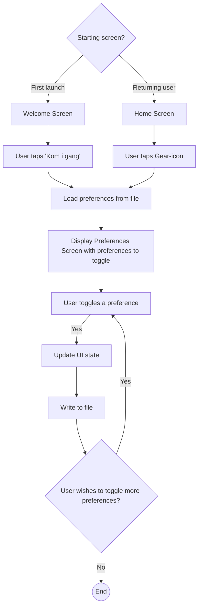

```mermaid
flowchart TD
  DecStart{Starting screen?}
  Welcome[Welcome Screen]
  Home[Home Screen]
  DecStart -- First launch --> Welcome
  DecStart -- Returning user --> Home

  Welcome --> UserNav1[User taps 'Kom i gang']
  Home --> UserNav2[User taps Gear-icon]

  UserNav1 & UserNav2 --> LoadPrefs[Load preferences from file]
  LoadPrefs --> DisplayPrefs[Display Preferences Screen with preferences to toggle]
  DisplayPrefs --> Toggle[User toggles a preference]
  Toggle -- Yes --> UpdateUI[Update UI state]
  UpdateUI --> Save[Write to file]
  Save --> More{User wishes to toggle more preferences?}
  More -- Yes --> Toggle
  More -- No --> End((End))
```

