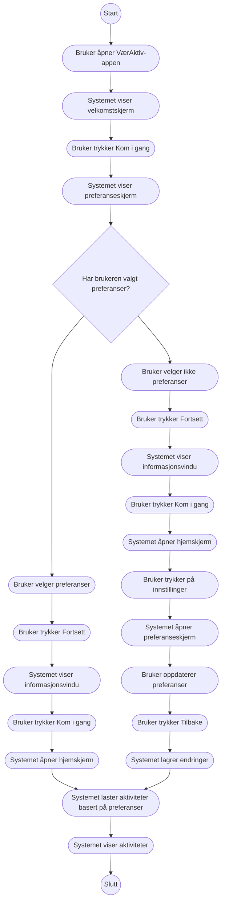

```mermaid

    flowchart TD;

    Start((Start))
    StartApp([Bruker åpner VærAktiv-appen])
    VisVelkomst([Systemet viser velkomstskjerm])
    TrykkKomIGang([Bruker trykker Kom i gang])
    VisPreferanser([Systemet viser preferanseskjerm])
    VelgPreferanser([Bruker velger preferanser])
    HoppOverPreferanser([Bruker velger ikke preferanser])
    TrykkFortsett([Bruker trykker Fortsett])
    VisInformasjon([Systemet viser informasjonsvindu])
    TrykkStart([Bruker trykker Kom i gang])
    AapneHjem([Systemet åpner hjemskjerm])
    LasterAktiviteter([Systemet laster aktiviteter basert på preferanser])
    ViserAktiviteter([Systemet viser aktiviteter])

    TrykkFortsettAlt([Bruker trykker Fortsett])
    VisInformasjonAlt([Systemet viser informasjonsvindu])
    TrykkStartAlt([Bruker trykker Kom i gang])
    AapneHjemAlt([Systemet åpner hjemskjerm])
    TrykkInnstillinger([Bruker trykker på innstillinger])
    AapnePreferanser([Systemet åpner preferanseskjerm])
    OppdaterPreferanser([Bruker oppdaterer preferanser])
    TrykkTilbake([Bruker trykker Tilbake])
    LagrerEndringer([Systemet lagrer endringer])

    Slutt((Slutt))

    HarPreferanser{Har brukeren valgt preferanser?}

    Start --> StartApp
    StartApp --> VisVelkomst
    VisVelkomst --> TrykkKomIGang
    TrykkKomIGang --> VisPreferanser
    VisPreferanser --> HarPreferanser
    HarPreferanser --> VelgPreferanser
    HarPreferanser --> HoppOverPreferanser
    VelgPreferanser --> TrykkFortsett
    TrykkFortsett --> VisInformasjon
    VisInformasjon --> TrykkStart
    TrykkStart --> AapneHjem
    AapneHjem --> LasterAktiviteter
    LasterAktiviteter --> ViserAktiviteter

    HoppOverPreferanser --> TrykkFortsettAlt
    TrykkFortsettAlt --> VisInformasjonAlt
    VisInformasjonAlt --> TrykkStartAlt
    TrykkStartAlt --> AapneHjemAlt
    AapneHjemAlt --> TrykkInnstillinger
    TrykkInnstillinger --> AapnePreferanser
    AapnePreferanser --> OppdaterPreferanser
    OppdaterPreferanser --> TrykkTilbake
    TrykkTilbake --> LagrerEndringer
    LagrerEndringer --> LasterAktiviteter
    ViserAktiviteter --> Slutt

```

