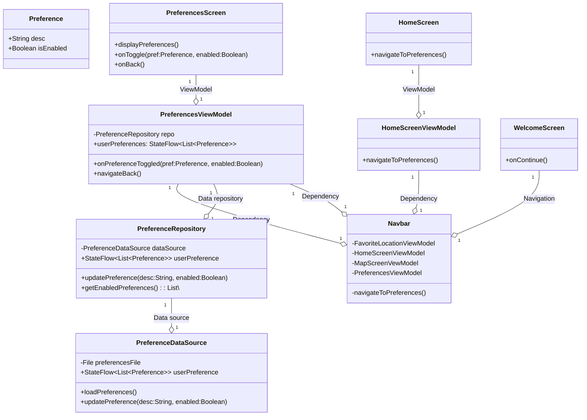

```mermaid
classDiagram
    class Preference {
      +String desc
      +Boolean isEnabled
    }

    class PreferenceDataSource {
      -File preferencesFile
      +StateFlow~List~Preference~~ userPreference
      +loadPreferences()
      +updatePreference(desc:String, enabled:Boolean)
    }

    class PreferenceRepository {
      -PreferenceDataSource dataSource
      +StateFlow~List~Preference~~ userPreference
      +updatePreference(desc:String, enabled:Boolean)
      +getEnabledPreferences(): List\<Preference\>
    }

    class PreferencesViewModel {
      -PreferenceRepository repo
      +userPreferences: StateFlow~List~Preference~~
      +onPreferenceToggled(pref:Preference, enabled:Boolean)
      +navigateBack()
    }

    class PreferencesScreen {
      +displayPreferences()
      +onToggle(pref:Preference, enabled:Boolean)
      +onBack()
    }

    class HomeScreen {
        +navigateToPreferences()
    }

    class HomeScreenViewModel {
      +navigateToPreferences()
    }

    class WelcomeScreen {
      +onContinue()
    }

    class Navbar {
      -FavoriteLocationViewModel
      -HomeScreenViewModel
      -MapScreenVewModel
      -PreferencesViewModel
      -navigateToPreferences()
    }

    HomeScreen "1" --o "1" HomeScreenViewModel : ViewModel
    PreferencesViewModel "1" --o "1" Navbar : Dependency
    PreferenceRepository "1" --o "1" PreferenceDataSource : Data source
    PreferencesViewModel "1" --o "1" PreferenceRepository : Data repository
    PreferencesScreen "1" --o "1" PreferencesViewModel : ViewModel
    HomeScreenViewModel "1" --o "1" Navbar : Dependency
    WelcomeScreen "1" --o "1" Navbar : Navigation
    Navbar "1" o-- "1" PreferencesViewModel : Dependency
    Preference
```