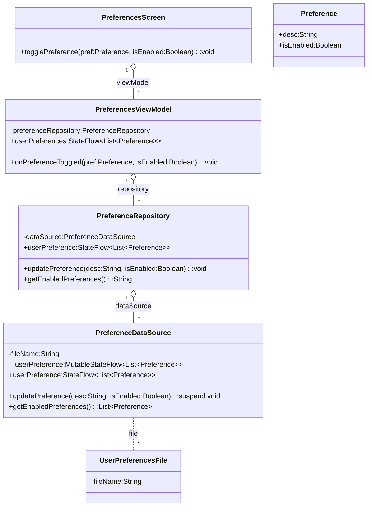

```mermaid
classDiagram
    PreferencesScreen "1" o-- "1" PreferencesViewModel : viewModel
    PreferencesViewModel "1" o-- "1" PreferenceRepository : repository
    PreferenceRepository "1" o-- "1" PreferenceDataSource : dataSource
    PreferenceDataSource .. "1" UserPreferencesFile : file

    class PreferencesScreen {
      +togglePreference(pref:Preference, isEnabled:Boolean):void
    }

    class PreferencesViewModel {
      -preferenceRepository:PreferenceRepository
      +userPreferences:StateFlow&lt;List&lt;Preference&gt;&gt;
      +onPreferenceToggled(pref:Preference, isEnabled:Boolean):void
    }

    class PreferenceRepository {
      -dataSource:PreferenceDataSource
      +userPreference:StateFlow&lt;List&lt;Preference&gt;&gt;
      +updatePreference(desc:String, isEnabled:Boolean):void
      +getEnabledPreferences():String
    }

    class PreferenceDataSource {
      -fileName:String
      -_userPreference:MutableStateFlow&lt;List&lt;Preference&gt;&gt;
      +userPreference:StateFlow&lt;List&lt;Preference&gt;&gt;
      +updatePreference(desc:String, isEnabled:Boolean):suspend void
      +getEnabledPreferences():List&lt;Preference&gt;
    }

    class Preference {
      +desc:String
      +isEnabled:Boolean
    }

    class UserPreferencesFile {
      -fileName:String
    }
```