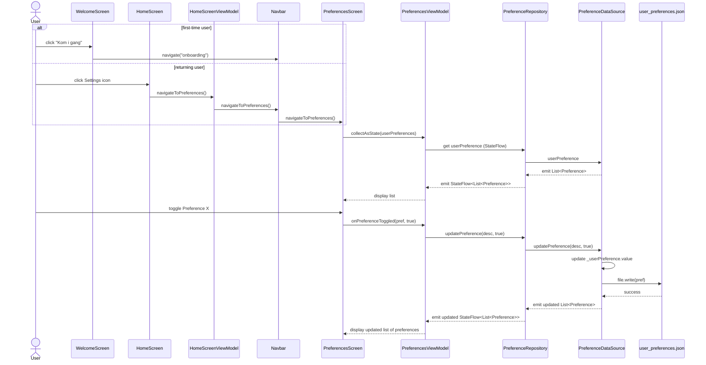

```mermaid
sequenceDiagram
    actor User
    participant Welcome as WelcomeScreen
    participant Home as HomeScreen
    participant HomeVM as HomeScreenViewModel
    participant Nav as Navbar

    participant PrefUI as PreferencesScreen
    participant PrefVM as PreferencesViewModel
    participant Repo as PreferenceRepository
    participant DS as PreferenceDataSource
    participant File as user_preferences.json

    alt first-time user
        User->>Welcome: click "Kom i gang"
        Welcome->>Nav: navigate("onboarding")
    else returning user
        User->>Home: click Settings icon
        Home->>HomeVM: navigateToPreferences()
        HomeVM->>Nav: navigateToPreferences()
        Nav->>PrefUI: navigateToPreferences()
    end
    PrefUI->>PrefVM: collectAsState(userPreferences)
    PrefVM->>Repo: get userPreference (StateFlow)
    Repo->>DS: userPreference
    DS-->>Repo: emit List<Preference>
    Repo-->>PrefVM: emit StateFlow<List<Preference>>
    PrefVM-->>PrefUI: display list

    User->>PrefUI: toggle Preference X
    PrefUI->>PrefVM: onPreferenceToggled(pref, true)
    PrefVM->>Repo: updatePreference(desc, true)
    Repo->>DS: updatePreference(desc, true)
    DS->>DS: update _userPreference.value
    DS->>File: file.write(pref)
    File-->>DS: success
    DS-->>Repo: emit updated List<Preference>
    Repo-->>PrefVM: emit updated StateFlow<List<Preference>>
    PrefVM-->>PrefUI: display updated list of preferences
```