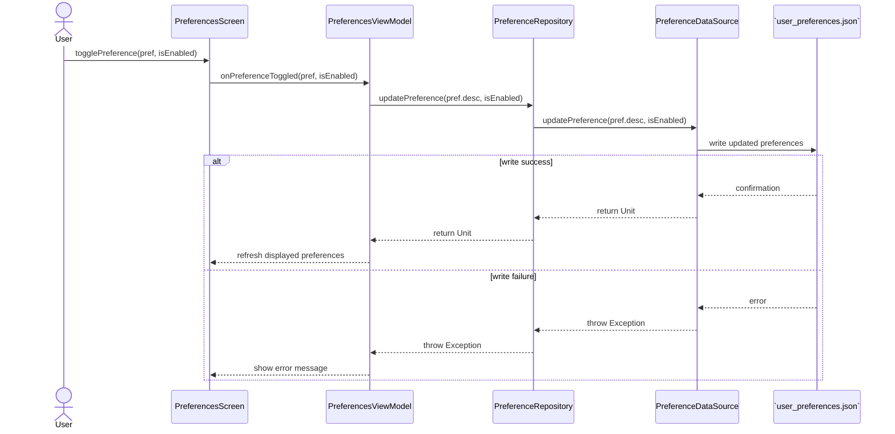

```mermaid
sequenceDiagram
    actor User
    participant UI as PreferencesScreen
    participant VM as PreferencesViewModel
    participant Repo as PreferenceRepository
    participant DS as PreferenceDataSource
    participant File as `user_preferences.json`

    User->>UI: togglePreference(pref, isEnabled)
    UI->>VM: onPreferenceToggled(pref, isEnabled)
    VM->>Repo: updatePreference(pref.desc, isEnabled)
    Repo->>DS: updatePreference(pref.desc, isEnabled)
    DS->>File: write updated preferences
    alt write success
        File-->>DS: confirmation
        DS-->>Repo: return Unit
        Repo-->>VM: return Unit
        VM-->>UI: refresh displayed preferences
    else write failure
        File-->>DS: error
        DS-->>Repo: throw Exception
        Repo-->>VM: throw Exception
        VM-->>UI: show error message
    end
```