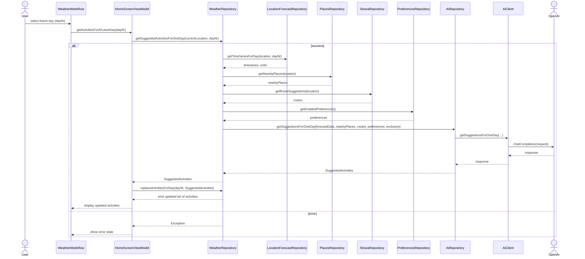

```mermaid
sequenceDiagram
    actor User
    participant UI as WeatherWeekRow
    participant VM as HomeScreenViewModel
    participant Repo as WeatherRepository
    participant LF as LocationForecastRepository
    participant Places as PlacesRepository
    participant Strava as StravaRepository
    participant Pref as PreferencesRepository
    participant AI as AiRepository
    participant Client as AiClient
    actor OpenAI

    User->>UI: select future day (dayNr)
    UI->>VM: getActivitiesForAFutureDay(dayNr)
    VM->>Repo: getSuggestedActivitiesForOneDay(currentLocation, dayNr)
    alt success
        Repo->>LF: getTimeSeriesForDay(location, dayNr)
        LF-->>Repo: timeseries, units
        Repo->>Places: getNearbyPlaces(location)
        Places-->>Repo: nearbyPlaces
        Repo->>Strava: getRouteSuggestions(location)
        Strava-->>Repo: routes
        Repo->>Pref: getEnabledPreferences()
        Pref-->>Repo: preferences
        Repo->>AI: getSuggestionsForOneDay(forecastData, nearbyPlaces, routes, preferences, exclusion)
        AI->>Client: getSuggestionsForOneDay(...)
        Client->>OpenAI: chatCompletion(request)
        OpenAI-->>Client: response
        Client-->>AI: response
        AI-->>Repo: SuggestedActivities
        Repo-->>VM: SuggestedActivities
        VM->>Repo: replaceActivitiesForDay(dayNr, SuggestedActivities)
        Repo-->>VM: emit updated list of activities
        VM-->>UI: display updated activities
    else error
        Repo-->>VM: Exception
        VM-->>UI: show error state
    end
```