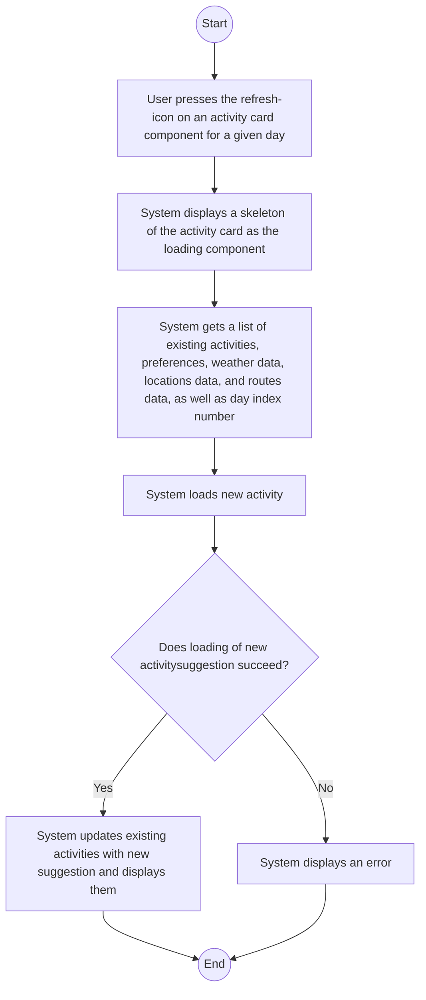

```mermaid
flowchart TD
    Start((Start))
    A[User presses the refresh-icon on an activity card component for a given day]
    B[System displays a skeleton of the activity card as the loading component]
    C[System gets a list of existing activities, preferences, weather data, locations data, and routes data, as well as day index number]
    D[System loads new activity]
    E{Does loading of new activitysuggestion succeed?}
    F[System updates existing activities with new suggestion and displays them]
    G[System displays an error]
    Slutt((End))

    Start --> A --> B --> C --> D --> E
    E -- Yes --> F --> Slutt
    E -- No --> G --> Slutt
```