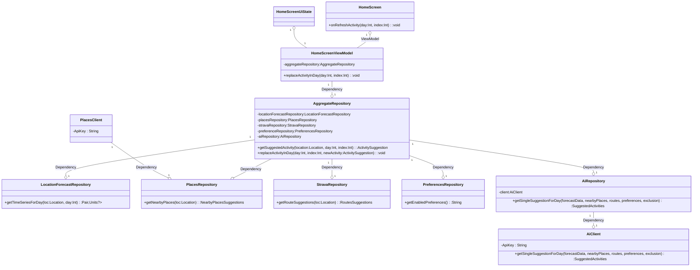

```mermaid
classDiagram
    HomeScreen "1" o-- "1" HomeScreenViewModel : ViewModel
    HomeScreenViewModel "1" --o "1" AggregateRepository : Dependency
    AggregateRepository "1" --o "1" LocationForecastRepository: Dependency
    AggregateRepository "1" --o "1" PlacesRepository: Dependency
    AggregateRepository "1" --o "1" StravaRepository: Dependency
    AggregateRepository "1" --o "1" PreferencesRepository: Dependency
    AggregateRepository "1" --o "1" AiRepository: Dependency
    AiRepository "1" --o "1" AiClient: Dependency
    PlacesClient "1" --o "1" PlacesRepository: Dependency
    HomeScreenUiState "1" o-- "1" HomeScreenViewModel

    class HomeScreenUiState {

    }

    class HomeScreen {
      +onRefreshActivity(day:Int, index:Int):void
    }

    class HomeScreenViewModel {
      -aggregateRepository:AggregateRepository
      +replaceActivityInDay(day:Int, index:Int):void
    }

    class AggregateRepository {
      -locationForecastRepository:LocationForecastRepository
      -placesRepository:PlacesRepository
      -stravaRepository:StravaRepository
      -preferenceRepository:PreferencesRepository
      -aiRepository:AiRepository
      +getSuggestedActivity(location:Location, day:Int, index:Int):ActivitySuggestion
      +replaceActivityInDay(day:Int, index:Int, newActivity:ActivitySuggestion):void
    }

    class LocationForecastRepository {
      +getTimeSeriesForDay(loc:Location, day:Int):Pair<List<TimeSeries>,Units?>
    }

    class PlacesRepository {
      +getNearbyPlaces(loc:Location):NearbyPlacesSuggestions
    }

    class StravaRepository {
      +getRouteSuggestions(loc:Location):RoutesSuggestions
    }

    class PreferencesRepository {
      +getEnabledPreferences():String
    }

    class AiRepository {
      -client:AiClient
+getSingleSuggestionForDay(forecastData, nearbyPlaces, routes, preferences, exclusion):SuggestedActivities
    }

    class AiClient {
        -ApiKey : String
+getSingleSuggestionForDay(forecastData, nearbyPlaces, routes, preferences, exclusion):SuggestedActivities
    }

    class PlacesClient {
        -ApiKey : String
    }
```