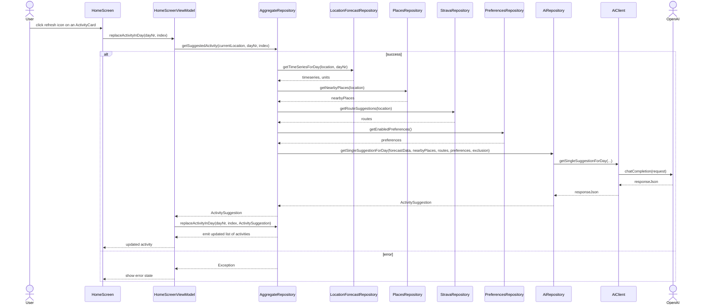

```mermaid
sequenceDiagram
    actor User
    participant UI as HomeScreen
    participant VM as HomeScreenViewModel
    participant Repo as AggregateRepository
    participant LF as LocationForecastRepository
    participant Places as PlacesRepository
    participant Strava as StravaRepository
    participant Pref as PreferencesRepository
    participant AI as AiRepository
    participant Client as AiClient
    actor OpenAI

    User->>UI: click refresh icon on an ActivityCard
    UI->>VM: replaceActivityInDay(dayNr, index)
    VM->>Repo: getSuggestedActivity(currentLocation, dayNr, index)
    alt success
        Repo->>LF: getTimeSeriesForDay(location, dayNr)
        LF-->>Repo: timeseries, units
        Repo->>Places: getNearbyPlaces(location)
        Places-->>Repo: nearbyPlaces
        Repo->>Strava: getRouteSuggestions(location)
        Strava-->>Repo: routes
        Repo->>Pref: getEnabledPreferences()
        Pref-->>Repo: preferences
        Repo->>AI: getSingleSuggestionForDay(forecastData, nearbyPlaces, routes, preferences, exclusion)
        AI->>Client: getSingleSuggestionForDay(...)
        Client->>OpenAI: chatCompletion(request)
        OpenAI-->>Client: responseJson
        Client-->>AI: responseJson
        AI-->>Repo: ActivitySuggestion
        Repo-->>VM: ActivitySuggestion
        VM->>Repo: replaceActivityInDay(dayNr, index, ActivitySuggestion)
        Repo-->>VM: emit updated list of activities
        VM-->>UI: updated activity
    else error
        Repo-->>VM: Exception
        VM-->>UI: show error state
    end
```