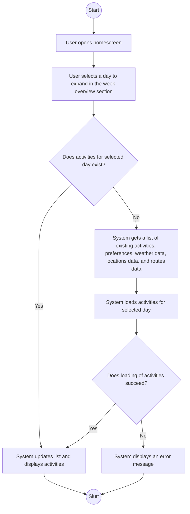

```mermaid
flowchart TD
    Start((Start))
    A[User opens homescreen]
    B[User selects a day to expand in the week overview section]
    B*[System gets a list of existing activities, preferences, weather data, locations data, and routes data]
    C{Does activities for selected day exist?}
    D[System loads activities for selected day]
    E{Does loading of activities succeed?}
    F[System updates list and displays activities]
    G[System displays an error message]
    Slutt((Slutt))

    Start --> A --> B --> C
    C -- Yes --> F --> Slutt
    C -- No --> B* --> D --> E
    E -- No --> G --> Slutt
    E -- Yes --> F
```