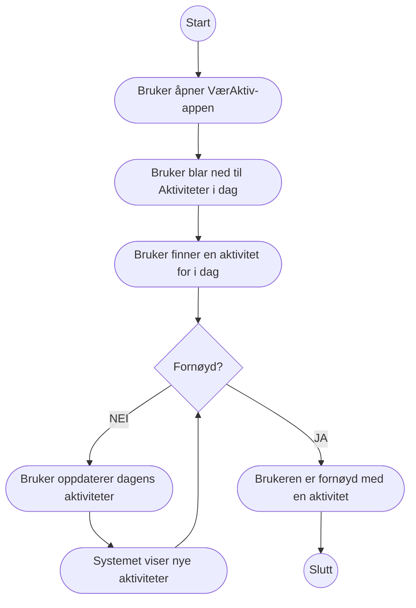

```mermaid

   flowchart TD;

    Start((Start))
    AapnerApp([Bruker åpner VærAktiv-appen])
    BlaNed([Bruker blar ned til Aktiviteter i dag])
    FinnAktivitet([Bruker finner en aktivitet for i dag])
    OppdaterAktiviteter([Bruker oppdaterer dagens aktiviteter])
    VisNyeAktiviteter([Systemet viser nye aktiviteter])
    AvslutterFornøyd([Brukeren er fornøyd med en aktivitet])
    Slutt((Slutt)) 

    ErFornøyd{Fornøyd?}

    Start --> AapnerApp
    AapnerApp --> BlaNed
    BlaNed --> FinnAktivitet
    FinnAktivitet --> ErFornøyd

    ErFornøyd -- NEI --> OppdaterAktiviteter
    OppdaterAktiviteter --> VisNyeAktiviteter
    VisNyeAktiviteter --> ErFornøyd

    ErFornøyd -- JA --> AvslutterFornøyd
    AvslutterFornøyd --> Slutt

```