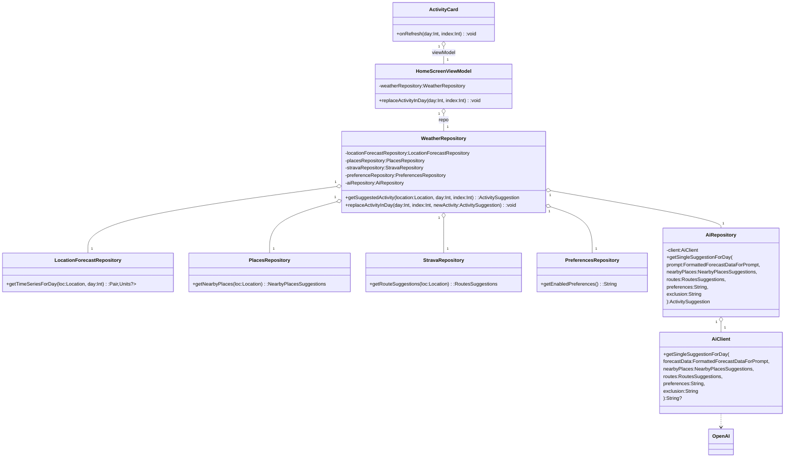

```mermaid
classDiagram
    ActivityCard "1" o-- "1" HomeScreenViewModel : viewModel
    HomeScreenViewModel "1" o-- "1" WeatherRepository : repo
    WeatherRepository "1" o-- "1" LocationForecastRepository
    WeatherRepository "1" o-- "1" PlacesRepository
    WeatherRepository "1" o-- "1" StravaRepository
    WeatherRepository "1" o-- "1" PreferencesRepository
    WeatherRepository "1" o-- "1" AiRepository
    AiRepository "1" o-- "1" AiClient
    AiClient ..> OpenAI

    class ActivityCard {
      +onRefresh(day:Int, index:Int):void
    }

    class HomeScreenViewModel {
      -weatherRepository:WeatherRepository
      +replaceActivityInDay(day:Int, index:Int):void
    }

    class WeatherRepository {
      -locationForecastRepository:LocationForecastRepository
      -placesRepository:PlacesRepository
      -stravaRepository:StravaRepository
      -preferenceRepository:PreferencesRepository
      -aiRepository:AiRepository
      +getSuggestedActivity(location:Location, day:Int, index:Int):ActivitySuggestion
      +replaceActivityInDay(day:Int, index:Int, newActivity:ActivitySuggestion):void
    }

    class LocationForecastRepository {
      +getTimeSeriesForDay(loc:Location, day:Int):Pair<List<TimeSeries>,Units?>
    }

    class PlacesRepository {
      +getNearbyPlaces(loc:Location):NearbyPlacesSuggestions
    }

    class StravaRepository {
      +getRouteSuggestions(loc:Location):RoutesSuggestions
    }

    class PreferencesRepository {
      +getEnabledPreferences():String
    }

    class AiRepository {
      -client:AiClient
      +getSingleSuggestionForDay(
         prompt:FormattedForecastDataForPrompt,
         nearbyPlaces:NearbyPlacesSuggestions,
         routes:RoutesSuggestions,
         preferences:String,
         exclusion:String
       ):ActivitySuggestion
    }

    class AiClient {
      +getSingleSuggestionForDay(
         forecastData:FormattedForecastDataForPrompt,
         nearbyPlaces:NearbyPlacesSuggestions,
         routes:RoutesSuggestions,
         preferences:String,
         exclusion:String
       ):String?
    }

    class OpenAI
```