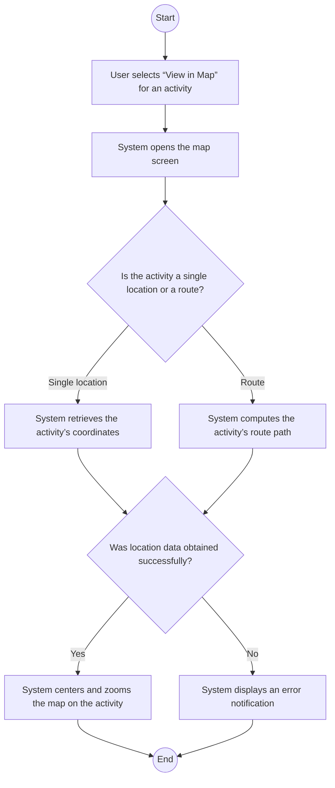

```mermaid
flowchart TD
  Start((Start))
  SelectView[User selects “View in Map” for an activity]
  OpenMap[System opens the map screen]
  IdentifyType{Is the activity a single location or a route?}
  RetrievePoint[System retrieves the activity’s coordinates]
  CalculateRoute[System computes the activity’s route path]
  DataReady{Was location data obtained successfully?}
  CenterMap[System centers and zooms the map on the activity]
  ShowError[System displays an error notification]
  End((End))

  Start --> SelectView --> OpenMap --> IdentifyType
  IdentifyType -- Single location --> RetrievePoint --> DataReady
  IdentifyType -- Route --> CalculateRoute --> DataReady
  DataReady -- Yes --> CenterMap --> End
  DataReady -- No --> ShowError --> End
``` 