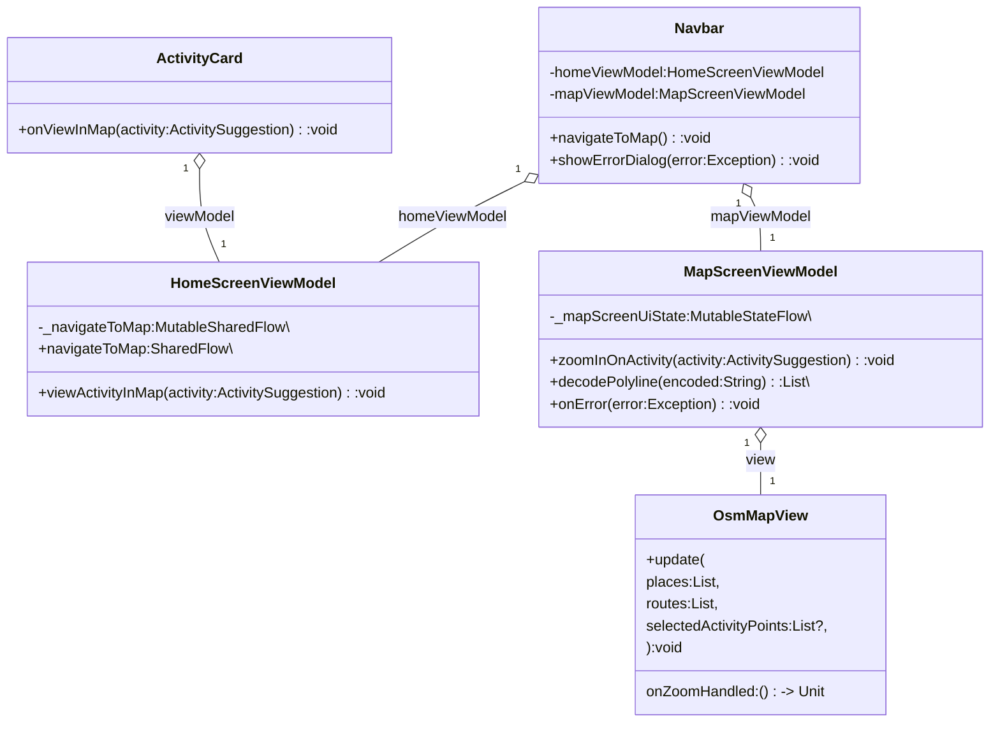

```mermaid
classDiagram
    ActivityCard "1" o-- "1" HomeScreenViewModel : viewModel
    Navbar "1" o-- "1" HomeScreenViewModel : homeViewModel
    Navbar "1" o-- "1" MapScreenViewModel : mapViewModel
    MapScreenViewModel "1" o-- "1" OsmMapView : view

    class ActivityCard {
      +onViewInMap(activity:ActivitySuggestion):void
    }

    class HomeScreenViewModel {
      -_navigateToMap:MutableSharedFlow\<ActivitySuggestion\>
      +navigateToMap:SharedFlow\<ActivitySuggestion\>
      +viewActivityInMap(activity:ActivitySuggestion):void
    }

    class Navbar {
      -homeViewModel:HomeScreenViewModel
      -mapViewModel:MapScreenViewModel
      +navigateToMap():void
      +showErrorDialog(error:Exception):void
    }

    class MapScreenViewModel {
      -_mapScreenUiState:MutableStateFlow\<MapScreenUiState\>
      +zoomInOnActivity(activity:ActivitySuggestion):void
      +decodePolyline(encoded:String):List\<GeoPoint\>
      +onError(error:Exception):void
    }

    class OsmMapView {
      +update(
        places:List\<PlaceActivitySuggestion\>,
        routes:List\<StravaActivitySuggestion\>,
        selectedActivityPoints:List\<GeoPoint\>?,
        onZoomHandled:() -> Unit
      ):void
    }
```