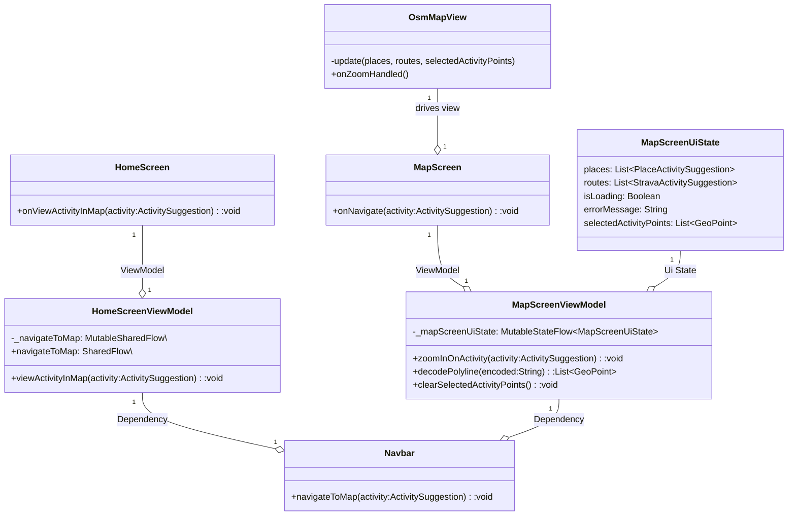

```mermaid
classDiagram
    HomeScreenViewModel "1" --o "1" Navbar : Dependency
    MapScreenViewModel "1" --o "1" Navbar : Dependency
    HomeScreen "1" --o "1" HomeScreenViewModel : ViewModel
    MapScreen "1" --o "1" MapScreenViewModel : ViewModel
    OsmMapView "1" --o "1" MapScreen  : drives view
    MapScreenUiState "1" --o "1" MapScreenViewModel : Ui State

    class HomeScreen {
      +onViewActivityInMap(activity:ActivitySuggestion):void
    }

    class HomeScreenViewModel {
      -_navigateToMap: MutableSharedFlow\<ActivitySuggestion\>
      +viewActivityInMap(activity:ActivitySuggestion):void
      +navigateToMap: SharedFlow\<ActivitySuggestion\>
    }

    class Navbar {
      +navigateToMap(activity:ActivitySuggestion):void
    }

    class MapScreen {
      +onNavigate(activity:ActivitySuggestion):void
    }

    class MapScreenUiState{
    places: List~PlaceActivitySuggestion~
    routes: List~StravaActivitySuggestion~
    isLoading: Boolean
    errorMessage: String
    selectedActivityPoints: List~GeoPoint~
  }

    class MapScreenViewModel {
      -_mapScreenUiState: MutableStateFlow~MapScreenUiState~
      +zoomInOnActivity(activity:ActivitySuggestion):void
      +decodePolyline(encoded:String):List~GeoPoint~
      +clearSelectedActivityPoints():void
    }

    class OsmMapView {
      -update(places, routes, selectedActivityPoints)
      +onZoomHandled()
    }
```