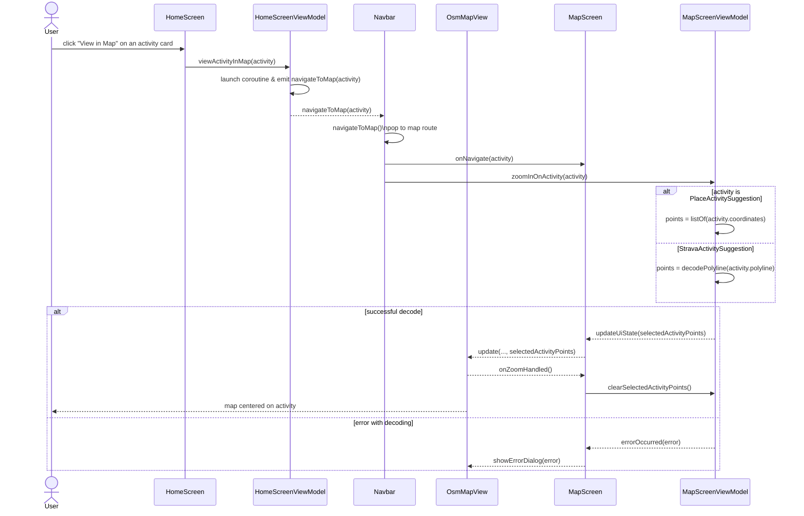

```mermaid
sequenceDiagram
    actor User
    participant UI as HomeScreen
    participant HomeVM as HomeScreenViewModel
    participant Nav as Navbar
    participant Osm as OsmMapView
    participant MS as MapScreen
    participant MapVM as MapScreenViewModel

    User->>UI: click "View in Map" on an activity card
    UI->>HomeVM: viewActivityInMap(activity)
    HomeVM->>HomeVM: launch coroutine & emit navigateToMap(activity)
    HomeVM-->>Nav: navigateToMap(activity)
    Nav->>Nav: navigateToMap()\npop to map route
    Nav->>MS: onNavigate(activity)
    Nav->>MapVM: zoomInOnActivity(activity)
        alt activity is PlaceActivitySuggestion
            MapVM->>MapVM: points = listOf(activity.coordinates)
        else StravaActivitySuggestion
            MapVM->>MapVM: points = decodePolyline(activity.polyline)
        end
    alt successful decode
        MapVM-->>MS: updateUiState(selectedActivityPoints)
        MS-->>Osm: update(..., selectedActivityPoints)
        Osm-->>MS: onZoomHandled()
        MS->>MapVM: clearSelectedActivityPoints()
        Osm-->>User: map centered on activity
    else error with decoding
        MapVM-->>MS: errorOccurred(error)
        MS-->>Osm: showErrorDialog(error)
    end
```